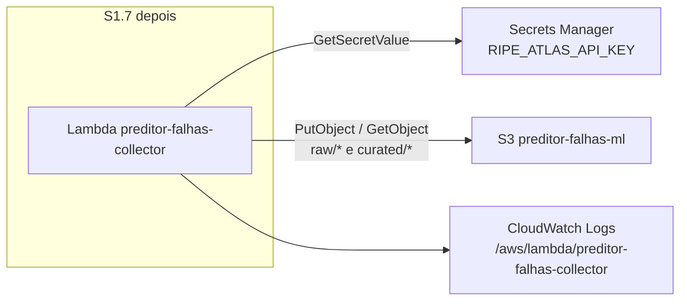

# S1.4 — Secrets e IAM da Lambda

Runbook + IaC para colocar `RIPE_ATLAS_API_KEY` fora do Git e criar a role da futura Lambda (S1.7) com least privilege.

**Stack CloudFormation:** [`infra/cloudformation/s1-secrets-iam-s3.yaml`](../infra/cloudformation/s1-secrets-iam-s3.yaml) (S1.4 + S1.5 no mesmo stack — a bucket policy precisa do ARN da role).

**Justificativa IaC vs só CLI:** CloudFormation reproduz secret + role + bucket com nomes e ARNs estáveis; os scripts `infra/aws/*.sh` são a superfície AWS CLI do card.

## Região

**Região efetiva (deploy 2026-09-11):** `sa-east-1`, conta `274394226829` (stack `preditor-falhas-s1`, `CREATE_COMPLETE`).

Padrão: **`sa-east-1`** (São Paulo), alinhada às probes BR do hub. Sobrescreva com `AWS_REGION` / `AWS_DEFAULT_REGION`.

## Diagrama



A função em si **não** entra neste card. A role já existe para o S1.7 assumir e para o S1.5 amarrar a bucket policy.

## Recursos (least privilege)

| Recurso | Nome canônico | Permissões da role |
|---|---|---|
| Secret | `RIPE_ATLAS_API_KEY` (`arn:aws:secretsmanager:sa-east-1:274394226829:secret:RIPE_ATLAS_API_KEY-A1lRzW`) | `secretsmanager:GetSecretValue`, `DescribeSecret` **só neste ARN** |
| S3 | `preditor-falhas-ml` | `s3:PutObject`, `s3:GetObject` em `raw/*` e `curated/*` (Get no curated para append do CSV) |
| Role | `preditor-falhas-s1-LambdaExecutionRole-bLuoV1hL3Slq` | assume só `lambda.amazonaws.com` + `SourceAccount`/`SourceArn` da fn `preditor-falhas-collector` |
| Logs | `/aws/lambda/preditor-falhas-collector` | `CreateLogGroup` no log group; `CreateLogStream` / `PutLogEvents` em `:*` |

Trust policy: `lambda.amazonaws.com` + `aws:SourceAccount` + `aws:SourceArn` da função reservada `preditor-falhas-collector`. **S1.7 deve criar a Lambda com esse nome**; senão o assume falha.

Não há `s3:ListBucket` na role (isso é S1.5b, leitura humana). Não há `s3:*` nem `Resource: *`.

## Variáveis de ambiente previstas (aplicar em S1.7)

| Variável | Valor |
|---|---|
| `S3_BUCKET` | output `BucketName` (`preditor-falhas-ml` se o nome estiver livre) |
| `ATLAS_MSM_IDS` | lista dos 6 IDs — **preencher no S1.6** |
| `AWS_REGION` | a região do stack |
| Secret | lido no runtime via `GetSecretValue` (não colocar a key em env da Lambda) |

## Git

`.gitignore` na raiz ignora `.env`, `.env.*` e `.aws/`. A key **nunca** vai em commit, template ou output de PR.

## Deploy (AWS CLI)

Credenciais: CLI **2.32+** e `aws login` (sessão curta). Neste Cloud Agent, o equivalente é secret de ambiente (`AWS_ACCESS_KEY_ID`, `AWS_SECRET_ACCESS_KEY`, `AWS_DEFAULT_REGION`) — o agente **não** deve gravar access key no disco do repo.

```bash
export AWS_REGION=sa-east-1
# opcional, se o nome global estiver tomado:
# export BUCKET_NAME=preditor-falhas-ml-<sufixo>
export RIPE_ATLAS_API_KEY='...'   # não commitar; não colar em issue/PR
./infra/aws/deploy.sh
./infra/aws/verify.sh
```

O secret é criado com um placeholder (`GenerateSecretString`). `deploy.sh` só grava o valor real se `RIPE_ATLAS_API_KEY` estiver no ambiente:

```bash
aws secretsmanager put-secret-value \
  --region sa-east-1 \
  --secret-id RIPE_ATLAS_API_KEY \
  --secret-string "$RIPE_ATLAS_API_KEY"
```

## Checklist de verificação (não imprime a key)

```bash
aws sts get-caller-identity --region sa-east-1

aws secretsmanager describe-secret \
  --region sa-east-1 \
  --secret-id RIPE_ATLAS_API_KEY \
  --query '{Name:Name,ARN:ARN}'

# prova GetSecretValue sem vazar o valor
aws secretsmanager get-secret-value \
  --region sa-east-1 \
  --secret-id RIPE_ATLAS_API_KEY \
  --query 'length(SecretString)'

# prova que a *role* (não o seu usuário) pode GetSecret + PutObject
aws iam simulate-principal-policy \
  --policy-source-arn "$(aws cloudformation describe-stacks \
      --stack-name preditor-falhas-s1 \
      --query "Stacks[0].Outputs[?OutputKey=='LambdaRoleArn'].OutputValue" \
      --output text)" \
  --action-names secretsmanager:GetSecretValue s3:PutObject \
  --resource-arns \
      "$(aws cloudformation describe-stacks --stack-name preditor-falhas-s1 \
          --query "Stacks[0].Outputs[?OutputKey=='SecretArn'].OutputValue" --output text)" \
      arn:aws:s3:::preditor-falhas-ml/raw/measurements/x.jsonl
```

A role **não** pode ser assumida pelo seu usuário IAM (`lambda.amazonaws.com` only). Por isso a prova de PutObject da role é `simulate-principal-policy`, não `sts assume-role`.

Script equivalente: `./infra/aws/verify.sh`.

### Evidência 2026-09-11 (valor do secret não impresso)

`./infra/aws/verify.sh` em `sa-east-1` / conta `274394226829`:

- `describe-secret` `RIPE_ATLAS_API_KEY` OK
- `GetSecretValue` OK (length=32; ainda é o placeholder do CloudFormation — **não** é a API key do Atlas)
- `iam simulate-principal-policy` na role: `GetSecretValue`, `s3:PutObject`, `s3:GetObject`, `logs:PutLogEvents` = `allowed`

Ainda falta: `aws secretsmanager put-secret-value --region sa-east-1 --secret-id RIPE_ATLAS_API_KEY --secret-string "$RIPE_ATLAS_API_KEY"` com a key real no ambiente.

## Fora deste card

Bucket layout e Block Public Access: [aws_s3.md](aws_s3.md). Função Lambda + EventBridge: S1.7. POST Atlas: S1.6. Grupo read-only do time: S1.5b.
