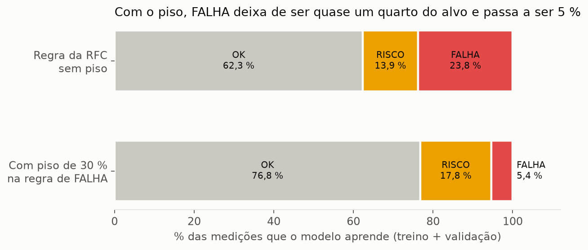
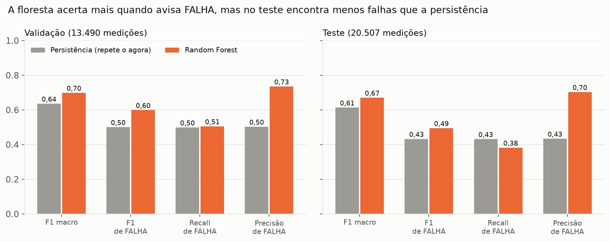
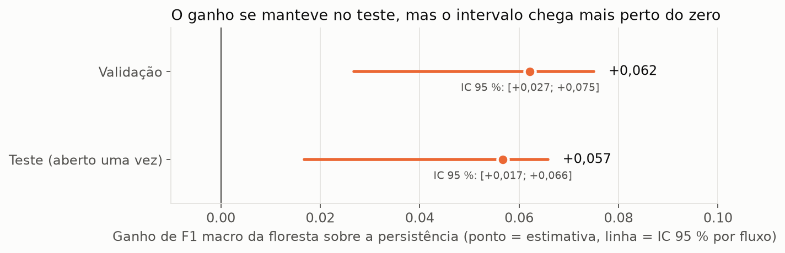
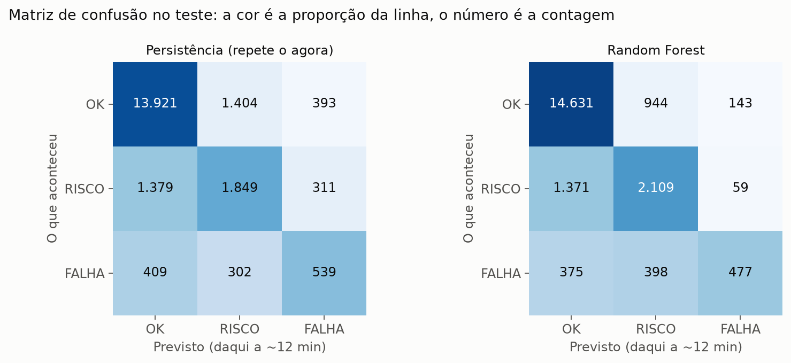

# Guia para escrever o artigo: o que medimos e por que escolhemos a Random Forest

Este documento **não é o artigo**. É a matéria-prima: a história em ordem, os números certos (com a fonte de cada
um), as figuras prontas e o raciocínio da escolha do modelo, em linguagem simples. Dá para copiar a ideia, os números
e as figuras; o texto e o tom ficam com você.

**As seções 2 a 6 são da validação; a seção 7 traz o teste.** O conjunto de teste foi aberto em 10/10/2026 e medido uma
única vez (relatório técnico em [`resultado_teste_final.md`](resultado_teste_final.md)). Quando o texto disser "o modelo
acerta X" fora da seção 7, leia "na validação, com 13.490 medições de 79 fluxos de rede".

**Estado do trabalho (10/10/2026):** a comparação, a exportação e o teste final estão prontos. O modelo escolhido (Random Forest)
está gravado em `data/modelo/exportado/modelo_final.joblib` (SHA-256 e versões no `LEIA-ME.md`, na mesma pasta). O relatório técnico
é [`relatorio_comparacao_modelos.md`](relatorio_comparacao_modelos.md). Os números abaixo vêm da comparação; a pasta `data/`
não vai para o git.

---

## 1. A história em sete frases

1. Redes de computadores degradam: o tempo de ida e volta (RTT) de um caminho sobe, pacotes se perdem. A pergunta é se
   dá para avisar **12 minutos antes** que um caminho vai de "normal" para "em risco" ou "em falha".
2. O RTT bruto engana: 340 ms pode ser normal em Brasil → África do Sul e ser um defeito em São Paulo → Rio. Por isso
   cada caminho (fluxo) é comparado **com o próprio normal**, aprendido nos primeiros 4,5 dias de medições dele.
3. Com isso, cada medição vira 10 números ("o quanto está acima do normal", "quantas das últimas 5 medições já estavam
   alteradas" etc.), e o modelo recebe só esses números. Nada de país, IP, rota nem RTT absoluto.
4. Testamos três famílias de modelo: **árvore de decisão**, **Random Forest** (uma floresta de 100 árvores) e
   **XGBoost** (árvores empilhadas, cada uma corrigindo a anterior), todas contra uma régua simples: a **persistência**
   ("daqui a 12 minutos vai estar igual a agora").
5. Os três modelos ganham da persistência. Com prova estatística (intervalo de 95 % que não cruza o zero) ganham a floresta, o XGBoost e a árvore ajustada com peso; a árvore da Tarefa 3 também, por pouco. Entre floresta e XGBoost, a diferença é
   pequena (menos de 0,02 de F1) e não dá para provar que um é melhor que o outro.
6. Escolhemos a **Random Forest** por uma regra definida antes de ver os resultados: entre os modelos praticamente
   empatados, vence o mais simples. Ela entrega praticamente o desempenho do XGBoost com menos "ajuste fino", mas **não** foi a campeã isolada em F1 (veja a seção 6, que é onde mora a honestidade do artigo).
7. Abrimos o teste **uma vez** e o resultado manteve o ganho sobre a persistência (F1 macro 0,670 contra 0,613), mas
   mostrou algo que a validação escondia: **a floresta encontra menos falhas reais (38 %) do que a persistência (43 %)**,
   embora erre muito menos quando avisa (precisão 0,70 contra 0,43). Veja a seção 7.

---

## 2. O problema e os dados (para o leitor leigo)

- **Fonte:** medições públicas de ping do RIPE Atlas, de 18/09 a 25/09/2026 (7 dias). São 82 caminhos (fluxos:
  sonda → destino), dos quais **79 têm "normal" calculável** e entram no modelo. Dois não tinham medições suficientes
  nos primeiros 4,5 dias, e um só apareceu depois.
- **O "normal" de cada caminho:** a mediana do RTT nas primeiras **108 horas**, exigindo ao menos 1.500 medições
  válidas. Usa-se mediana e MAD (desvio absoluto mediano) em vez de média e desvio-padrão, porque as falhas que queremos
  detectar são justamente os picos que inflam a média e "alargam" o normal até engolir o problema.
- **As três classes** (regras da RFC, seção 8.4): **OK**, **RISCO** (alteração moderada ou repetida) e **FALHA**
  (alteração forte, timeouts ou perda alta). O rótulo vem de uma política explícita, não de agrupamento automático.
- **O que o modelo prevê:** a classe da **3ª medição à frente** do mesmo fluxo, de 10 a 14 minutos depois. Não é
  detectar o que está acontecendo agora, é antecipar.
- **Separação no tempo:** treino (os primeiros 50 % do tempo), validação (de 50 % a 70 %) e teste (o resto). Sem sorteio
  e sem embaralhar: o modelo nunca vê o futuro. As últimas 3 medições de cada fluxo em treino e validação são
  descartadas (o futuro delas cairia no bloco seguinte).
- **Tamanho:** 34.661 medições de treino, **13.490 de validação** e **20.507 de teste**. Na validação, só 592 (4,4 %) são
  FALHA; no teste, 1.250 (6,1 %).

**Uma analogia para o artigo:** é um termômetro que sabe a temperatura "normal" de cada cômodo da casa. Em vez de dizer
"está fazendo 30 °C" (quente para um quarto, normal para a cozinha com o forno ligado), ele diz "está 8 graus acima do
normal deste cômodo, e já faz 20 minutos".

---

## 3. A decisão que mudou o jogo: o piso de 30 % nas falhas

Esta é a parte "de bastidores" que costuma agradar ao leitor: o resultado só fez sentido depois de arrumar o rótulo.

- A regra 3 da RFC chama de FALHA qualquer medição com `z_robusto ≥ 3,5` (muito longe do normal). Em caminhos
  **muito estáveis**, o MAD é minúsculo, e uma variação de décimos de milissegundo já dá um z enorme. Resultado: **88 % das
  "falhas" por essa regra tinham aumento de RTT menor que 30 %**, o que é difícil de chamar de falha.
- A professora liberou dar um **piso** às regras (relato do dono, 09/10/2026). Passamos a exigir também `aumento ≥ 30 %`,
  o mesmo limite que a tabela da RFC já usa para chamar algo de RISCO. O 30 vem da própria tabela, não de uma busca.
- Efeito: dos 70.616 pontos do dataset, a regra 3 caiu de **16.305 para 1.935**. Os 14.370 que saíram viraram OK
  (11.436), RISCO (2.929) ou outra regra de FALHA (5). Entre eles, a mediana do aumento era de **4,2 %** e 9.251 tinham
  z ≥ 8, ou seja: eram fluxos tão estáveis que qualquer oscilação virava "extrema".
- Para quem treina o modelo, FALHA passou de **23,8 % para 5,4 %** do alvo (treino + validação). Passou a ser uma
  classe rara, e por isso mais difícil.



**Cuidado ao escrever:** os números de F1 de antes e depois do piso **não são comparáveis**, porque o alvo mudou. A
persistência cai de 0,722 para 0,636 por isso, e não porque o método piorou. Só compare modelos entre si dentro do mesmo
rótulo.

---

## 4. Os modelos, em português

| Modelo | Como explicar | Como foi treinado |
|---|---|---|
| **Persistência** (régua) | "Vai estar igual a agora." Não aprende nada. | — |
| **Árvore de decisão** | Uma sequência de perguntas de sim/não ("o aumento passou de 30 %? Das últimas 5 medições, 2 já estavam alteradas?"). Dá para ler e virar regra em português. | Duas versões: a da Tarefa 3 (29 folhas) e a ajustada, com duas colunas de histórico e peso de classe (40 folhas). |
| **Random Forest** | 100 árvores treinadas em sorteios diferentes dos dados e das colunas, que **votam**. Uma árvore sozinha decora o treino; a votação cancela os erros individuais. | 32 combinações de tamanho testadas; escolhida: 100 árvores, profundidade 8, folha mínima de 50 medições. |
| **XGBoost** | Árvores pequenas empilhadas: cada nova árvore corrige o erro das anteriores. | 16 combinações; escolhida: 300 árvores no total (100 por classe), taxa de aprendizado 0,1, profundidade 4. |

**Regras iguais para todos (esta é a parte que dá justiça à comparação):**
- mesmas 10 colunas de entrada, nas mesmas medições da validação;
- mesmo peso de classe (OK 1, RISCO 2, FALHA 1,5), para o modelo não ignorar a classe rara;
- semente 16 fixa: refazer o treino dá o mesmo modelo;
- treino só no treino; a validação serve para escolher o tamanho de cada modelo;
- **sem parada antecipada**, porque ela usaria a validação para treinar;
- valores ausentes ficam ausentes (ninguém troca RTT faltando por zero).

---

## 5. Resultados

### 5.1 Placar geral (validação, 13.490 medições)

| Modelo | F1 macro | Acerto geral | F1 FALHA | Recall FALHA | Precisão FALHA | Recall RISCO | Tamanho |
|---|---|---|---|---|---|---|---|
| Persistência | 0,636 | 81,7 % | 0,500 | 0,498 | 0,503 | 0,512 | — |
| Árvore da Tarefa 3 | 0,686 | 85,9 % | 0,580 | 0,478 | 0,737 | 0,477 | 29 folhas |
| Árvore ajustada | 0,685 | 85,2 % | 0,566 | 0,505 | 0,643 | 0,532 | 40 folhas |
| **Random Forest** | **0,698** | 85,5 % | 0,599 | 0,505 | 0,735 | 0,543 | 100 árvores (8.658 folhas) |
| XGBoost | **0,701** | 85,5 % | 0,598 | 0,514 | 0,717 | 0,560 | 300 árvores (4.380 folhas) |

(F1 macro = média simples dos F1 de OK, RISCO e FALHA: pesa a classe rara tanto quanto a comum. Precisão FALHA e
acerto geral foram calculados a partir da matriz de confusão gravada.)


**Como ler:** o acerto geral parece alto (81,7 % só repetindo o agora) porque 80 % das medições são OK e ficam OK. Por
isso o F1 macro e o recall de FALHA contam mais que o acerto geral. É um bom ponto para o artigo explicar por que
"acertar 85 %" não é o mesmo que "ser bom".

### 5.2 Onde cada modelo ganha


- **OK:** todos acertam bem (0,89 a 0,92). A persistência só perde um pouco.
- **RISCO e FALHA:** é onde os modelos treinados se separam da persistência (+0,06 a +0,10 de F1).


Leitura da matriz da Random Forest: de 592 falhas reais, ela acertou 299 (recall 0,505) e deixou passar 190 como OK.
Das 407 vezes em que disse FALHA, acertou 299 (precisão 0,735): **quando ela avisa, costuma estar certa; o problema é
o que ela deixa passar**.

### 5.3 O que ninguém consegue (e vale dizer)


Nos 201 casos em que o caminho estava **OK e 12 minutos depois estava em FALHA**, os modelos acertam entre 16 e 20 %
(a persistência, 0 % por definição). Isto é, **prever o começo de uma falha repentina continua difícil**. O que os
modelos fazem bem é acompanhar o que já está degradando (RISCO que continua, FALHA que continua). No rótulo anterior ao piso, 68 % dos
episódios de FALHA duravam uma medição só (seção 7 do relatório de análise; não foi refeito para o rótulo atual): falha
que aparece e some não deixa pista antes.

### 5.4 Mais complexo não é melhor


Cada ponto é uma combinação testada. As maiores florestas (mais de 100 mil nós) empatam com a escolhida (17 mil nós) e
com o XGBoost de 8 mil nós. **O desempenho encosta num teto em torno de 0,70**, não importa quanto se aumente o
modelo. Isso diz algo sobre os dados, não sobre o algoritmo.

### 5.5 O que a floresta usa


As colunas de **histórico** (quantas das últimas 5 medições já estavam alteradas, o desvio médio das últimas 5) somam
mais da metade da importância. Timeout e perda de pacote praticamente não contam na importância (não investigamos o motivo; uma hipótese, não
verificada, é que sejam raros neste dataset). Boa frase para o artigo: "o que mais avisa o futuro não é o susto de agora, é a tendência dos últimos minutos".
(Importância de árvores mostra quanto a coluna foi usada, não que ela cause o problema.)

---

## 6. Por que a Random Forest (a parte que a professora e o leitor vão querer ler)

### 6.1 A regra, fixada antes de ver os números

> Entre os modelos cujo F1 macro na validação está a até **0,005** do melhor, vence o **mais simples**
> (árvore, depois floresta, depois XGBoost).

Decidimos isso na especificação, antes de treinar floresta ou boosting. É a mesma regra que já escolhia o tamanho da
árvore: evita escolher um modelo mais pesado por uma diferença que pode ser só sorte.

### 6.2 O que a regra viu

| Modelo | F1 macro | Dentro da faixa de 0,005? |
|---|---|---|
| XGBoost | 0,7006 (o maior) | sim |
| Random Forest | 0,6977 | sim |
| Árvore ajustada | 0,6851 | **não** (0,0155 abaixo) |

A árvore ajustada ficou de fora. Entre floresta e XGBoost, que ficaram dentro, a floresta é a mais simples. **Ela venceu
pela regra, não por ser a campeã em F1.** O XGBoost tem 0,003 a mais, o que está dentro do ruído.

### 6.3 O que a estatística diz


Intervalos de confiança de 95 %, reamostrando os 79 fluxos 2.000 vezes:

| Comparação | Diferença de F1 macro | Intervalo 95 % | Há prova de que é maior? |
|---|---|---|---|
| Random Forest − persistência | +0,062 | [+0,027; +0,075] | **sim** |
| XGBoost − persistência | +0,065 | [+0,024; +0,081] | **sim** |
| Random Forest − árvore ajustada | +0,013 | [−0,002; +0,022] | não |
| XGBoost − árvore ajustada | +0,015 | [−0,0005; +0,026] | não, por pouco |
| Árvore ajustada com peso − persistência | +0,050 | [+0,025; +0,060] | **sim** |
| Árvore da Tarefa 3 − persistência | +0,051 | [+0,002; +0,063] | **sim, por pouco** |
| XGBoost − Random Forest | +0,003 | [−0,004; +0,011] | não |

As duas últimas linhas da tabela (as das árvores contra a persistência) vêm de `data/analise_piso_regra3/ic_ganho.csv`,
com o mesmo método; as outras vêm de `data/modelo/comparacao/ic_pareado.csv`.

Traduzindo: **floresta, XGBoost e a árvore ajustada com peso ganham da persistência com certeza (a árvore da Tarefa 3,
por pouco); ganhar da árvore ajustada e um do outro não dá para afirmar** com estes dados. O artigo deve dizer isso com
todas as letras.

### 6.4 Os argumentos a favor da floresta (em ordem de força)

1. **Empate prático com o melhor, com menos ajuste fino.** Floresta tem poucos botões sensíveis; o XGBoost depende de
   taxa de aprendizado, número de rodadas e profundidade, e o máximo bruto da grade dele ficou na borda da busca.
2. **Menos risco de decorar.** A diferença entre F1 de treino e de validação foi de 0,018 na floresta e 0,031 no XGBoost
   (da busca gravada): a floresta generaliza com menos folga entre o que viu e o que não viu.
3. **Mais estável a ruído (argumento geral, não medido por nós).** A votação de árvores independentes costuma ser
   robusta a picos isolados, que são comuns em medição pública. Não testamos isso diretamente aqui.
4. **Mais fácil de defender.** "100 árvores votando" é uma frase que o leitor entende; "300 árvores corrigindo
   umas às outras" também, mas exige mais conversa.

### 6.5 Os argumentos contra (diga-os, dá credibilidade)

- O XGBoost teve o maior F1 e o maior recall de FALHA (0,514 contra 0,505); a floresta venceu pela regra, não no
  placar.
- A floresta é **mais lenta**: busca de 165 s contra 19 s do XGBoost, e previsão de 0,041 s contra 0,016 s na validação
  inteira. Para este uso (uma previsão por medição, a cada ~4 minutos), a diferença é irrelevante, mas existe.
- Ela é **maior** (17 mil nós, contra 8,5 mil do XGBoost).
- **Perde a legibilidade da árvore:** a árvore ajustada tem 40 folhas que viram regras em português ("se o aumento passou
  de X % e Y das últimas 5 já estavam alteradas, então RISCO"). A floresta é uma caixa-preta de 100 árvores; só se
  explica por importância de colunas. A professora liberou adaptar o projeto, mas é um custo real, e é a razão de a
  árvore ajustada ser entregue junto.

### 6.6 Uma frase honesta para o artigo (sugestão, adapte ao seu tom)

> "Testamos três modelos. Os três ganharam da regra 'vai ficar igual', e os três com prova estatística (a árvore, por pouco). Entre árvore,
> floresta e XGBoost, as diferenças ficaram dentro do ruído, então seguimos a regra que definimos antes: ficar com o
> mais simples dos que estão empatados com o melhor. Foi a Random Forest. O XGBoost tem um número ligeiramente maior,
> mas não o suficiente para justificar um modelo mais sensível a ajustes."

**Evite escrever** "a Random Forest foi a mais precisa" ou "a mais efetiva": os números não sustentam. Pode escrever "a
floresta empatou com o melhor e foi a escolha mais segura".

---

## 7. O teste final: a prova que só se faz uma vez

O teste é o trecho mais recente do tempo (24/09 08:09 a 25/09 02:07), guardado fechado desde o começo. Foi aberto **uma
única vez**, em 10/10/2026, com o modelo e as regras já definidos: nada foi ajustado depois de ver o resultado. Mediu-se
só a Random Forest e a persistência (o XGBoost e a árvore ajustada não foram ao teste, para não gastar a única medição em
vários modelos). Relatório técnico: [`resultado_teste_final.md`](resultado_teste_final.md).

### 7.1 Validação × teste



| Métrica | Random Forest, validação | Random Forest, teste | Persistência, teste |
|---|---|---|---|
| F1 macro | 0,698 | **0,670** | 0,613 |
| F1 de OK / RISCO / FALHA | 0,917 / 0,577 / 0,599 | 0,912 / 0,603 / 0,495 | 0,886 / 0,521 / 0,432 |
| Recall de FALHA | 0,505 | **0,382** | 0,431 |
| Precisão de FALHA | 0,735 | 0,703 | 0,434 |
| Acerto geral | 85,5 % | 84,0 % | 79,5 % |
| Acerto em OK → FALHA | 17,4 % | 12,2 % | 0 % |

(Precisão de FALHA da validação calculada da matriz gravada; as demais, dos CSVs. O número de medições é 13.490 na
validação e 20.507 no teste.)

**A leitura honesta, em três pontos:**

1. **O ganho se manteve.** O F1 macro da floresta fica 0,057 acima da persistência (na validação eram 0,062), e o
   intervalo de confiança de 95 % por fluxo, [+0,017; +0,066], continua acima do zero. Pela regra que fixamos antes de
   abrir o teste, a entrega é um **preditor de 12 minutos**. Mas o limite inferior (+0,017) é pequeno: a prova é real,
   porém fraca.

   

2. **O F1 caiu e o recall de FALHA piorou.** Era esperado que o F1 caísse (0,698 para 0,670) num trecho novo do tempo.
   O que não era esperado: o recall de FALHA da floresta (0,382) ficou **abaixo** do da persistência (0,431). Dos 1.250
   casos de FALHA do teste, a floresta achou 477 e a persistência, 539.
3. **Em compensação, a floresta erra muito menos quando avisa.** Ela disse FALHA 679 vezes e acertou 477 (precisão 0,70);
   a persistência disse FALHA 1.243 vezes e acertou 539 (precisão 0,43). Isto é: **cerca de 200 alarmes falsos contra
   cerca de 700**. A floresta troca alguns acertos por muito menos ruído.

Uma frase possível para o artigo: *"A floresta é mais cautelosa que a regra 'vai ficar igual': ela deixa passar algumas
falhas, mas quase não grita à toa."* Sobre o porquê de o recall ter caído, **não investigamos**. O teste é outro trecho
do tempo e tem uma fatia de FALHA um pouco maior (6,1 %, contra 4,4 % na validação e 5,8 % no treino), mas não
verificamos se isso explica a queda.

### 7.2 Onde a floresta acerta e erra no teste



- **Das 1.250 falhas reais**, a floresta classificou 477 como FALHA, 398 como RISCO e 375 como OK. Ou seja, cerca de metade
  das falhas perdidas foi para a classe vizinha (RISCO): o modelo percebeu que algo estava errado, mas subestimou.
- **Dos 3.539 casos de RISCO**, só 59 viraram FALHA: a floresta quase nunca "exagera" para FALHA.
- **Quando o futuro muda** (4.198 casos), a floresta acerta 36,4 %; a persistência, por definição, 0 %. Quando o futuro
  é igual ao agora, a floresta acerta 96,2 %.
- **Antecipar o início de uma falha** (OK que vira FALHA, 409 casos): 12,2 %. Continua sendo o que ninguém consegue bem.
- **Falha que continua** (FALHA que segue FALHA, 539 casos): 77,7 %. É aí que o modelo é mais útil.

### 7.3 Dois casos concretos para ilustrar

(Escolhidos por uma regra definida antes, sem sorteio e sem "pinçar" o exemplo mais bonito.)

- **Acerto em caminho longo e estável:** fluxo `6349|202.6.102.41|154581679`, em 24/09/2026 às 20:27:49, RTT de 382 ms
  (a mediana do caminho está acima da mediana dos 79 fluxos, ou seja, é um caminho longo). Estava OK, o modelo previu OK, e ficou OK.
- **Erro relevante:** fluxo `6891|150.164.1.222|28095697`, em 24/09/2026 às 15:08:00. Era FALHA no momento e era FALHA 12
  minutos depois, mas o modelo previu OK. **Atenção antes de citar:** o RTT desse fluxo é de 0,14 ms, muito baixo para um
  destino fora da rede da sonda; vale confirmar que o destino é da mesma rede antes de usá-lo como exemplo. Além disso,
  como a falha já estava em curso, a persistência teria acertado esse caso.

### 7.4 Fluxos que o modelo não viu

Não há. Os 79 fluxos com "normal" calculável aparecem nos três blocos (treino, validação e teste), e os demais não têm
medições suficientes no período inicial. O diário da Tarefa 5 prevê esse caso: declarar a limitação, sem forçar a conta.
Portanto **não sabemos como o modelo se comporta num fluxo totalmente novo**. É uma limitação a dizer no artigo.

### 7.5 O que dizer sobre o teste, sem se enganar

- O teste confirmou que o modelo **ganha da régua simples**, e isso é o que se pedia de um preditor.
- O teste **não** diz que o modelo é bom em achar falhas: o recall de FALHA é de 38 %.
- O teste **não** compara floresta com árvore ou XGBoost. Essa comparação é só da validação.
- O resultado vale para 79 fluxos em 7 dias, com a nossa definição de falha (piso de 30 %).

---

## 8. Ressalvas que um bom artigo deve ter

1. **A comparação entre os três modelos é só da validação.** A validação foi usada para escolher o tamanho dos modelos
   *e* para compará-los, o que deixa a comparação levemente otimista. O teste (seção 7) mediu só a floresta e a persistência.
2. **Poucos fluxos.** São 79 caminhos e 7 dias. Os intervalos de confiança foram calculados reamostrando fluxos,
   justamente porque medições do mesmo fluxo não são independentes.
3. **FALHA é rara** (4,4 % da validação). Pequenas mudanças de contagem movem muito o F1 dela.
4. **O rótulo é uma política, não a verdade.** O modelo aprende a regra da RFC com o piso. Ele não vê "falhas reais de
   roteador": vê a nossa definição de falha em medições de ping. Dizer isso é parte do trabalho.
5. **O piso de 30 % é decisão nossa**, ainda que tirada da própria tabela da RFC. Sem ele, os números de F1 seriam
   outros e mais altos para FALHA, mas por motivos questionáveis (picos em fluxos muito estáveis).
6. **Antecipar começos de falha segue difícil** (16 a 20 % de acerto). O ganho real está em acompanhar degradações que já
   começaram.
7. **O baseline é fixo**: não acompanha troca de rota, e o conjunto são sondas Anchor, não a rede de um campus.
8. **O modelo só opera em fluxo com ficha** (1.500 medições válidas no período inicial) e recebe métricas relativas, não
   RTT bruto.
9. **No teste, a floresta encontrou menos falhas que a persistência** (recall 0,38 contra 0,43). Não dá para vender o
   modelo como "detector de falhas mais sensível": ele é mais preciso, não mais sensível.
10. **Fluxo novo não foi testado:** todos os fluxos estão no treino (seção 7.4).

---

## 9. Ângulos e títulos possíveis

- *"O normal de cada caminho: como ensinamos uma máquina a desconfiar do jeito certo"* (ênfase no baseline por fluxo).
- *"Três modelos, uma régua boba: o que acontece quando você compara ML com 'vai ficar igual'"* (ênfase na
  persistência; é um ótimo gancho, porque muita gente esquece de comparar com a régua mais simples).
- *"Quando o rótulo estava errado: 88 % das nossas 'falhas' eram oscilação"* (ênfase no piso; é a melhor história
  de bastidor).
- *"Por que não escolhemos o modelo com o maior número"* (ênfase na regra fixada antes e no empate).
- *"A prova que só se faz uma vez: o que o teste final nos contou"* (ênfase na seção 7: o ganho se manteve, mas o
  recall de FALHA caiu; é o ângulo mais honesto e talvez o mais interessante para o leitor).

**Estrutura sugerida (blog, ~1.500 a 2.000 palavras):** gancho (a pergunta dos 12 minutos) → o normal de cada caminho →
a surpresa do rótulo (figura 8) → os três concorrentes e a régua → resultado (figuras 1 e 3) → o que ninguém consegue
(figura 5) → por que floresta (figura 2 e a regra) → o teste final (figuras 9 e 11: o ganho se manteve, mas o recall caiu) →
limites e o que vem a seguir.

---

## 10. Glossário em uma linha

- **RTT:** tempo de ida e volta de um pacote, em milissegundos.
- **Fluxo:** um caminho específico (sonda → destino) medido ao longo do tempo.
- **Baseline / "normal":** mediana do RTT do fluxo nas primeiras 108 horas.
- **z robusto:** quantos "desvios típicos" a medição está acima do normal, usando mediana e MAD.
- **Persistência:** prever que o futuro é igual ao presente. A régua que todo modelo precisa vencer.
- **F1 macro:** nota de 0 a 1 que equilibra precisão e recall e dá o mesmo peso às três classes.
- **Recall de FALHA:** das falhas reais, quantas o modelo achou. **Precisão de FALHA:** dos avisos de falha, quantos
  eram falha de verdade.
- **Validação / teste:** partes do tempo separadas do treino; a validação serve para escolher, o teste (aberto em
  10/10/2026, medido uma única vez no fim) serve para uma medição final, sem ajustar nada depois.
- **Intervalo de confiança (IC) de 95 %:** faixa em que a diferença verdadeira provavelmente está; se inclui o zero, não
  dá para afirmar que um modelo é melhor que o outro.

---

## 11. De onde vem cada número

| O que | Arquivo |
|---|---|
| Placar, F1 por classe, recall, OK→FALHA, tamanho | `data/modelo/comparacao/comparacao_modelos.csv` |
| Matrizes de confusão (contagens); precisão e acerto geral calculados daqui | `data/modelo/comparacao/matriz_comparacao.csv` |
| Intervalos de confiança | `data/modelo/comparacao/ic_pareado.csv` |
| Escolha e motivo | `data/modelo/comparacao/escolha.json` |
| Combinações testadas e diferença treino × validação | `data/modelo/comparacao/busca_floresta.csv`, `busca_boosting.csv` |
| Importância das colunas | `data/modelo/comparacao/importancias.csv` |
| Tempos de treino e previsão | `data/modelo/comparacao/tempos.csv` (variam até ~10 % entre execuções) |
| Piso: regras antes × depois, destino, composição do alvo | `data/analise_piso_regra3/contagem_regras.csv`, `destino_rebaixadas.csv`, `classes_no_modelo.csv`; análise completa na seção 8 de `docs/relatorio_analise_arvore.md` |
| Tamanho dos blocos | `data/gold/contagem_classes.csv` |
| Ganho da árvore sobre a persistência, com IC (validação, rótulo atual) | `data/analise_piso_regra3/ic_ganho.csv` |
| Teste: matriz, métricas por classe, acerto por transição | `data/modelo/teste/matriz_teste.csv`, `metricas_teste.csv` |
| Teste: IC do ganho, casos concretos, declaração, contagem de fluxos e classes | `data/modelo/teste/ic_ganho_teste.csv`, `casos_teste.txt`, `resultado.json` |
| Relatório técnico do teste | `docs/resultado_teste_final.md`, `docs/ficha_modelo_final.md` |
| Modelo exportado: SHA-256, tamanho, versões | `data/modelo/exportado/LEIA-ME.md` |
| Relatório técnico da comparação | `docs/relatorio_comparacao_modelos.md` |

**Regerar as figuras** (a partir da raiz do projeto; o matplotlib não é dependência do projeto):

```bash
uv run --with matplotlib python docs/figuras_artigo/gerar_figuras.py
```

As 11 figuras (01 a 08 da validação; 09 a 11 do teste) ficam em `docs/figuras_artigo/` (PNG, 160 dpi, fundo claro). Cada modelo mantém a mesma cor em todas
(cinza = persistência, violeta = árvore da Tarefa 3, azul = árvore ajustada, laranja = Random Forest, verde =
XGBoost).
