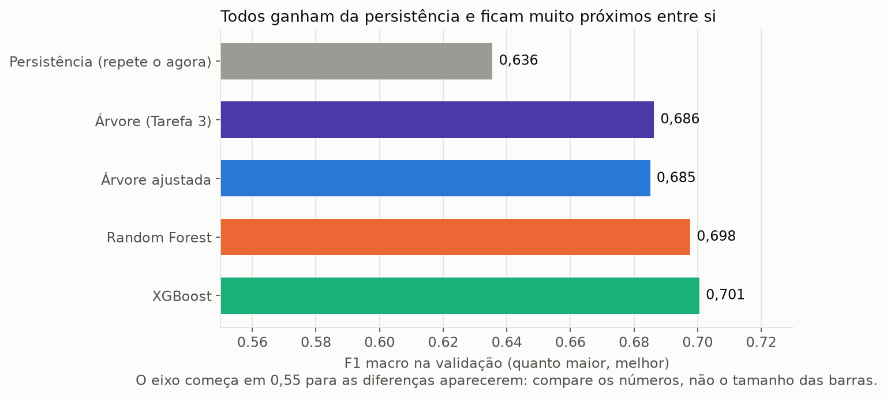
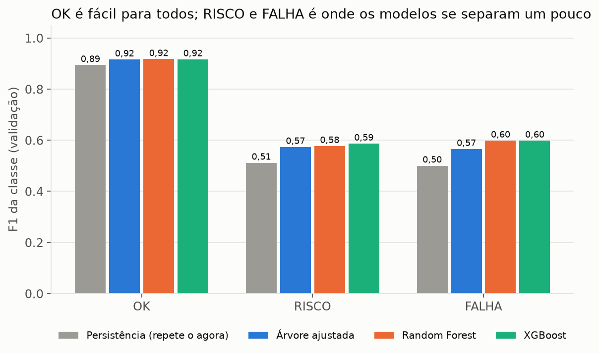
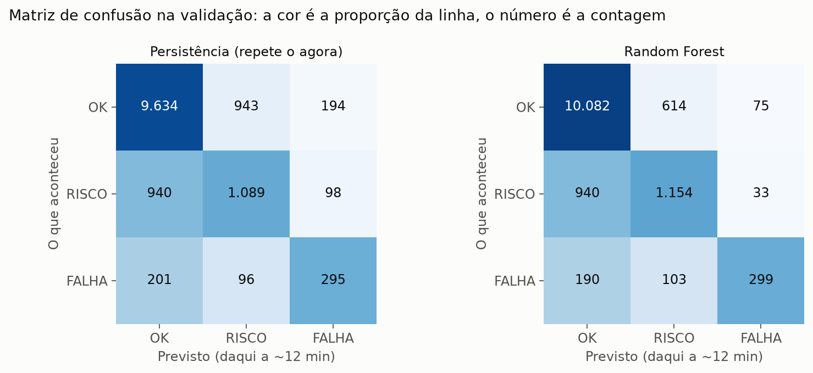
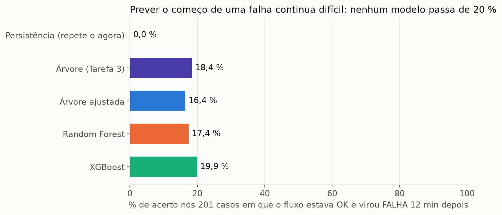
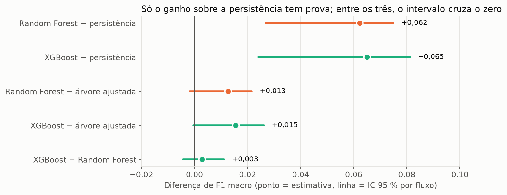
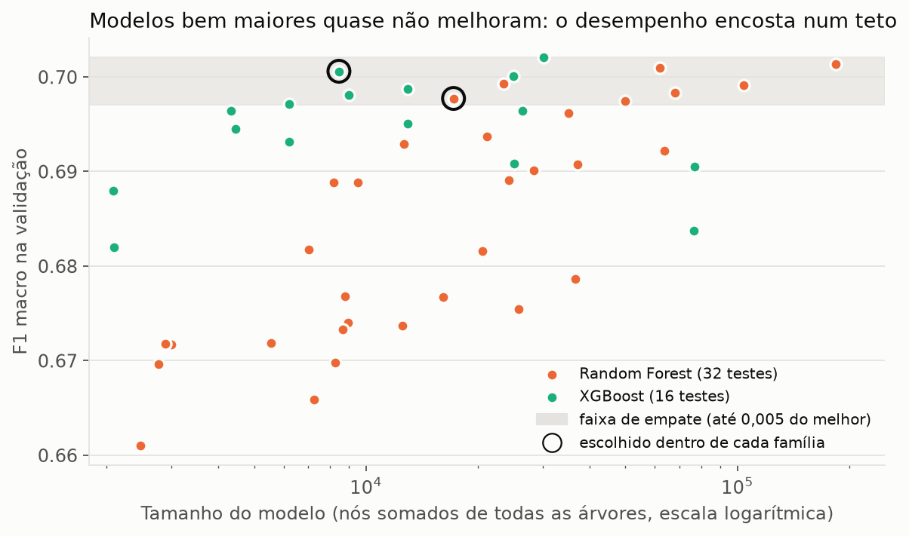
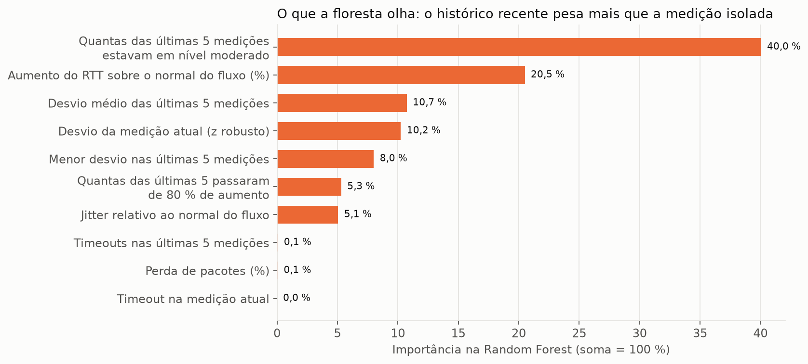

# Relatório: comparação árvore × Random Forest × XGBoost e o modelo exportado

Data: 10/10/2026. Spec: `SPEC-comparacao-modelos.md`. Plano e tarefas: `tasks/plan-comparacao-modelos.md` e
`tasks/todo-comparacao-modelos.md`. Versão narrativa para o artigo: [`guia_para_o_artigo.md`](guia_para_o_artigo.md).

**Como foi feito.** Tudo foi medido na validação (13.490 medições, 79 fluxos). O teste continua fechado: só o seu N é
conhecido e nenhuma de suas linhas foi lida ou medida. Cada número deste relatório vem de uma execução: os CSVs de
`data/modelo/comparacao/` (gravados pelo `comparar`) e o `data/modelo/exportado/LEIA-ME.md` (gravado pelo `exportar`).
As figuras de `figuras_artigo/` leem só esses CSVs. Semente 16 em tudo.

> **Nota sobre o rótulo.** Todos os números deste relatório usam o rótulo com o piso de 30 % na regra 3
> (`docs/relatorio_analise_arvore.md`, seção 8). O F1 **não se compara** com os números de antes do piso (por exemplo,
> 0,7457 da árvore da Tarefa 3 e 0,7221 da persistência daquele rótulo): o alvo mudou.

## 1. Resumo

- A **persistência** ("daqui a 12 minutos, igual a agora") tem F1 macro de 0,6355 na validação. Os três modelos
  treinados ficam acima dela: árvore da Tarefa 3 0,6863; árvore ajustada com peso 0,6851; Random Forest 0,6977;
  XGBoost 0,7006.
- Com prova estatística (IC 95 % por fluxo que não cruza o zero), a Random Forest e o XGBoost ganham da persistência. A
  árvore ajustada com peso também ganha com prova; a árvore da Tarefa 3 ganha por pouco (limite inferior +0,0023).
- **Ninguém ganha da árvore ajustada com prova.** As diferenças entre Random Forest, XGBoost e árvore ajustada cruzam o
  zero. A diferença entre Random Forest e XGBoost (0,0029) também cruza o zero.
- A regra de escolha (tolerância de 0,005 sobre o maior F1 macro da validação, depois o mais simples) escolheu a
  **Random Forest**: 100 árvores, profundidade 8, folha mínima de 50. Ela **não** é a de maior F1: o XGBoost tem 0,0029 a
  mais, dentro da tolerância.
- Antecipar o início de uma falha continua difícil: entre os 201 casos em que o caminho está OK e vira FALHA em 12
  minutos, os modelos acertam de 16 % a 20 %.
- O modelo escolhido foi exportado (`data/modelo/exportado/modelo_final.joblib`). Ele abre sem o pacote `preditor`, a
  reabertura em processo novo reproduz as previsões da validação exatamente, e aceita valores ausentes.

## 2. Dados e método

| Bloco | Medições | FALHA | Uso |
|---|---|---|---|
| Treino | 34.661 | 2.012 (5,8 %) | só para treinar |
| Validação | 13.490 | 592 (4,4 %) | para escolher hiperparâmetros e comparar as famílias |
| Teste | fechado | fechado | medição única na Tarefa 5 |

Validação: 79 fluxos. O conjunto de entrada (X) são as **10 colunas** da árvore ajustada: as 8 da Tarefa 3 mais
`min5_z` e `media5_z` (o menor e a média do z robusto nas últimas 5 medições). Região, país, IP, rota e RTT absoluto
ficam fora (a RFC proíbe). O alvo é `status_futuro`. Valores ausentes ficam ausentes: nada é preenchido.

Regras iguais para as três famílias: mesmo X, mesmo peso de classe {OK 1; RISCO 2; FALHA 1,5}, semente 16, `fit` só
com o treino, sem parada antecipada. Cada família tem sua própria busca na grade, medida na validação.

| Família | Grade | Combinações | Escolhida (F1 macro na validação) |
|---|---|---|---|
| Random Forest | `n_estimators` {100, 300} × `max_depth` {4, 6, 8, 12} × `min_samples_leaf` {20, 50, 100, 200}, `max_features`=sqrt | 32 | 100 árvores, profundidade 8, folha 50 (0,6977) |
| XGBoost | `n_estimators` {100, 300} × `learning_rate` {0,05; 0,1} × `max_depth` {2, 3, 4, 6} | 16 | 100 rodadas (300 árvores), taxa 0,1, profundidade 4 (0,7006) |
| Árvore ajustada (Tarefa 4) | ajustada com peso, adotada na Tarefa 4 | 56 | 40 folhas, com o rótulo atual (0,6851) |

A grade foi proposta no plano e não foi ampliada (decisão do dono, 10/10/2026). O IC é bootstrap por fluxo: 2.000
reamostras, semente 16, o mesmo sorteio para os modelos comparados.

## 3. Resultados na validação

| Modelo | F1 macro | F1 OK | F1 RISCO | F1 FALHA | Recall FALHA | Recall RISCO | Acerto geral | Precisão FALHA |
|---|---|---|---|---|---|---|---|---|
| Persistência | 0,6355 | 0,8943 | 0,5119 | 0,5004 | 0,4983 | 0,5120 | 81,7 % | 0,503 |
| Árvore da Tarefa 3 | 0,6863 | 0,9205 | 0,5585 | 0,5799 | 0,4780 | 0,4767 | 85,9 % | 0,737 |
| Árvore ajustada com peso | 0,6851 | 0,9158 | 0,5737 | 0,5658 | 0,5051 | 0,5322 | 85,2 % | 0,643 |
| **Random Forest** | **0,6977** | 0,9173 | 0,5773 | 0,5986 | 0,5051 | 0,5425 | 85,5 % | 0,735 |
| XGBoost | **0,7006** | 0,9166 | 0,5868 | 0,5984 | 0,5135 | 0,5604 | 85,5 % | 0,717 |

Acerto geral e precisão de FALHA vêm da matriz (`matriz_comparacao.csv`). F1 macro é a média simples dos três F1: a classe
rara (FALHA) pesa tanto quanto OK. O acerto geral é alto porque 79,8 % das medições da validação são OK, e a persistência
já acerta 81,7 % repetindo o agora. Por isso o F1 macro e o recall de FALHA são os números que importam.





### 3.1 Onde cada família erra

Transições (agora → futuro) na validação. OK → FALHA são 201 medições; FALHA → OK são 194 (o "pico isolado" que some em 12
minutos, que chamamos de FALHA isolada).

| Modelo | OK → FALHA: acerto | FALHA isolada (FALHA → OK): acerto | Acerto quando o futuro muda |
|---|---|---|---|
| Persistência | 0,0 % | 0,0 % | 0,0 % |
| Árvore da Tarefa 3 | 18,4 % | 73,7 % | 39,6 % |
| Árvore ajustada com peso | 16,4 % | 44,8 % | 36,1 % |
| Random Forest | 17,4 % | 59,8 % | 35,7 % |
| XGBoost | 19,9 % | 62,4 % | 36,4 % |

- **Antecipar o início de uma falha não funciona bem em nenhuma família** (16 % a 20 %, contra 0 % da persistência, que
  por definição não prevê mudança). Os modelos fazem melhor acompanhar uma falha que já começou.
- **A árvore da Tarefa 3 acerta mais a FALHA isolada** (73,7 %), e as florestas e o XGBoost acertam menos (59,8 % e 62,4 %).
  Em compensação, as florestas acertam mais RISCO (recall 0,543 e 0,560, contra 0,477 da árvore da Tarefa 3).
- **Matriz da Random Forest** na validação: das 592 FALHAs reais, 299 são acertadas, 190 viram OK e 103 viram RISCO. Ela
  prevê FALHA 407 vezes, e 299 estão certas (precisão 0,735). Quando avisa, costuma acertar; o problema é o que deixa passar.





## 4. Incerteza: o ganho tem prova?

IC 95 % da diferença de F1 macro, por bootstrap de fluxos (79 fluxos, 2.000 reamostras, semente 16). Fonte: `ic_pareado.csv`
(as três primeiras linhas da família) e `data/analise_piso_regra3/ic_ganho.csv` (a árvore da Tarefa 3 e a ajustada, na mesma
validação e com o mesmo método, medidos na análise do piso).

| Comparação | Diferença de F1 macro | IC 95 % | Prova de que é maior? |
|---|---|---|---|
| Random Forest − persistência | +0,0622 | [+0,0268; +0,0750] | sim |
| XGBoost − persistência | +0,0651 | [+0,0240; +0,0812] | sim |
| Árvore ajustada com peso − persistência | +0,0496 | [+0,0246; +0,0598] | sim |
| Árvore da Tarefa 3 − persistência | +0,0508 | [+0,0023; +0,0627] | sim, por pouco |
| Árvore ajustada sem peso − persistência | +0,0464 | [−0,0013; +0,0576] | não |
| Random Forest − árvore ajustada com peso | +0,0126 | [−0,0017; +0,0216] | **não** |
| XGBoost − árvore ajustada com peso | +0,0155 | [−0,0005; +0,0262] | **não** |
| XGBoost − Random Forest | +0,0029 | [−0,0043; +0,0113] | **não** |

- O ganho sobre a persistência é real para os modelos de conjunto e para a árvore ajustada com peso.
- O ganho da Random Forest e do XGBoost sobre a árvore ajustada **não tem prova**: os dois intervalos cruzam o zero. O do
  XGBoost cruza por pouco.
- A diferença entre Random Forest e XGBoost **não tem prova**. A escolha entre as duas é pela regra, não por uma diferença
  comprovada.



## 5. Busca, tamanho e custo

### 5.1 O que a busca mostrou

- **Random Forest**: 7 das 32 combinações ficam dentro da tolerância de 0,005 do melhor. O melhor bruto (300 árvores,
  profundidade 12, folha 20; F1 0,7013) está nas **três bordas** da grade. A escolhida (100 árvores, profundidade 8,
  folha 50) tem F1 de treino 0,7155 e de validação 0,6977: diferença de 0,0178.
- **XGBoost**: 6 das 16 combinações ficam dentro da tolerância. O melhor bruto (100 rodadas, taxa 0,05, profundidade 6;
  F1 0,7021) está nas bordas: `n_estimators` e `learning_rate` na inferior, `max_depth` na superior. A escolhida tem F1 de
  treino 0,7315 e de validação 0,7006: diferença de 0,0309, a maior das duas famílias.
- A grade foi mantida como proposta do plano, sem ampliação (decisão do dono). Como o melhor bruto está nas bordas,
  uma grade maior poderia mudar a escolha. Isso não foi testado.



### 5.2 Tamanho e tempo

| Modelo | Árvores | Folhas | Nós | Busca inteira (s) | Um treino (s) | Previsão na validação (s) |
|---|---|---|---|---|---|---|
| Árvore da Tarefa 3 | 1 | 29 | 57 | 16,1 | — | 0,0010 |
| Árvore ajustada com peso | 1 | 40 | 79 | 35,3 | — | 0,0012 |
| Random Forest | 100 | 8.658 | 17.216 | 165,0 | 1,59 a 8,80 (soma 140,3) | 0,0413 |
| XGBoost | 300 | 4.380 | 8.460 | 18,9 | 0,20 a 1,16 (soma 8,7) | 0,0161 |

Tempos de `tempos.csv` (última execução do `comparar`). Os tempos variam de uma execução para outra (a busca da Random
Forest ficou entre 162 s e 175 s em execuções diferentes). Por isso `tempos.csv` fica fora da checagem de "mesma execução, mesmos
arquivos". A previsão é a mediana de três medições na validação inteira. Nenhuma grade passou de 10 minutos.

## 6. O que os modelos usam

Importância das colunas (soma 1 em cada modelo, `importancias.csv`). "Histórico" são as 5 colunas que olham as últimas 5
medições: `n5_timeout`, `n5_aumento80`, `n5_moderado`, `min5_z`, `media5_z`.

| Coluna | Random Forest | XGBoost | Árvore ajustada |
|---|---|---|---|
| `n5_moderado` | 0,400 | 0,630 | 0,616 |
| `aumento_pct` | 0,205 | 0,131 | 0,133 |
| `media5_z` | 0,107 | 0,019 | 0,005 |
| `z_robusto` | 0,102 | 0,020 | 0,012 |
| `min5_z` | 0,080 | 0,029 | 0,020 |
| `n5_aumento80` | 0,053 | 0,129 | 0,211 |
| `jitter_relativo` | 0,051 | 0,013 | 0,002 |
| `n5_timeout` | 0,0007 | 0,022 | 0,000 |
| `perda_pct` | 0,0005 | 0,007 | 0,000 |
| `timeout_atual` | 0,000 | 0,000 | 0,000 |
| **Peso do histórico** | **64,2 %** | **82,9 %** | **85,3 %** |

- Nas três famílias, o peso das colunas de histórico é mais da metade, e é maior que o peso das colunas da medição atual
  (`aumento_pct`, `z_robusto`, `jitter_relativo`, `perda_pct`, `timeout_atual`).
- `timeout_atual`, `perda_pct` e `n5_timeout` quase não entram na Random Forest. Não investigamos o motivo. Uma
  hipótese, não testada, é que timeouts e perdas sejam raros neste dataset.
- Importância mostra quanto a coluna foi usada nas divisões, não que ela causa a falha.



## 7. A decisão

A regra foi fixada na spec, antes de treinar as florestas e o boosting (`SPEC-comparacao-modelos.md`, "Regra de escolha",
itens 1 e 2): entre as candidatas (árvore ajustada, Random Forest, XGBoost), ficam as que estão a até 0,005 do maior
F1 macro da validação, e entre elas vence a mais simples, pela ordem árvore, Random Forest, XGBoost. A persistência e a
árvore da Tarefa 3 são só referência.

| Candidata | F1 macro (validação) | Dentro da tolerância? |
|---|---|---|
| Árvore ajustada com peso | 0,6851 | não (0,0155 abaixo do melhor) |
| **Random Forest** | **0,6977** | **sim** |
| XGBoost | 0,7006 (o maior) | sim |

Entre as duas que ficaram dentro, a Random Forest é a mais simples, e ela venceu. A escolha foi feita pelo código, a partir de
`comparacao_modelos.csv` e da regra. A escolhida supera a persistência (0,6977 contra 0,6355).

- **Não foi a campeã em F1.** O XGBoost tem o maior F1 (0,7006) e o maior recall de FALHA (0,5135, contra 0,5051). A
  diferença entre os dois é 0,0029, dentro da tolerância e sem prova estatística (IC de −0,0043 a +0,0113).
- A spec registrava a expectativa de que a Random Forest fosse a mais efetiva. Esta hipótese **não** se confirmou em F1:
  ela foi escolhida pela regra, que privilegia o mais simples dentro da tolerância.
- A Random Forest tem argumentos a favor: tem menos parâmetros sensíveis, a diferença entre treino e validação é menor
  (0,0178 contra 0,0309 do XGBoost), e a grade do XGBoost teve o melhor bruto na borda. Tem também contras: é a mais
  lenta (165 s de busca contra 19 s; previsão de 0,041 s contra 0,016 s), é maior (17 mil nós contra 8,5 mil) e não tem
  regras legíveis como a árvore.
- A árvore ajustada continua disponível em arquivo à parte, com regras em português (`regras_arvore_ajustada.txt`), porque
  é o modelo legível do projeto.

## 8. O modelo exportado

`uv run python -m preditor exportar` refez o modelo escolhido e a árvore ajustada, só com o treino, com os parâmetros
gravados, e confirmou que o refeito dá o F1 medido (0,697714 para a Random Forest; 0,685091 para a árvore). Depois gravou os
arquivos numa pasta temporária, abriu cada um num processo novo, rodou o exemplo de uso a partir de outra pasta, e só então
copiou para `data/modelo/exportado/`. A pasta fica em `data/`, que o git ignora.

| Arquivo | Tamanho | SHA-256 |
|---|---|---|
| `modelo_final.joblib` | 1,75 MB | `197579cba624b57c2d70c07e7db40524fc09d36ebfb7b9c083715e2d3809e48d` |
| `arvore_ajustada.joblib` | 9,5 KB | `9025233764c681d12ceff559e292463174180e8551397e9d95060d23fe094afd` |

Verificações feitas na exportação e numa conferência independente (um processo separado, sem o pacote `preditor`):

- O `.joblib` abre sem importar o pacote `preditor`, e o arquivo não contém o nome do pacote.
- A reabertura em processo novo reproduz exatamente as previsões da validação (13.490 medições).
- O F1 macro recalculado a partir do arquivo, com o scikit-learn direto, dá 0,697713828 (o `escolha.json` tem 0,697714).
- Os 103 valores ausentes da validação são aceitos, e uma medição sem nenhum valor recebe uma das três classes.
- Só saem OK, RISCO e FALHA.
- Duas exportações seguidas dão os mesmos SHA-256: a exportação é determinística.

O dicionário gravado traz o modelo, as 10 colunas na ordem, as classes, a semente (16), os parâmetros e as versões. As
versões usadas: Python 3.14.7; scikit-learn 1.9.1; xgboost 3.4.1; numpy 2.5.3; pandas 3.0.6; joblib 1.6.0.

**Aviso.** Um `.joblib` é um pickle, e abri-lo executa código. O LEIA-ME traz o SHA-256 para conferir antes de abrir, e
o aviso. Outra versão do scikit-learn pode não abrir o arquivo; por isso as versões acima ficam no LEIA-ME.

## 9. Ressalvas

1. **A validação foi usada duas vezes.** Ela escolheu os hiperparâmetros e também comparou as famílias. A escolha entre
   famílias fica levemente otimista. O IC e a exigência de não cruzar o zero limitam isso, mas não eliminam (spec, risco 4).
2. **Poucos fluxos.** São 79 caminhos e 7 dias. Os intervalos foram calculados por fluxo, porque as medições de um mesmo
   fluxo não são independentes.
3. **FALHA é rara** (4,4 % da validação). Pequenas mudanças de contagem movem o F1 de FALHA, e a precisão de FALHA (0,643 a
   0,737) tem a mesma fragilidade.
4. **O rótulo é uma política.** O modelo aprende a regra da RFC com o piso de 30 % de aumento, não a falha real do roteador.
5. **Ganho sobre a árvore não comprovado.** Random Forest e XGBoost não superam a árvore ajustada com prova. A escolha da
   Random Forest é uma decisão da regra, e a diferença para o XGBoost é menor que a incerteza.
6. **Grades nas bordas.** O melhor bruto das duas famílias está em bordas da grade. A conclusão pode mudar com uma grade
   maior; não foi testado (decisão do dono: manter a grade).
7. **Teto dos dados.** Os modelos ficam em torno de 0,70 de F1 macro. A seção 7 do relatório de análise mediu, com o
   rótulo anterior ao piso, que modelos mais fortes não passam de 0,77; o diagnóstico não foi refeito com o rótulo atual.
8. **O baseline é fixo**, e o conjunto são sondas Anchor, não a rede de um campus.
9. **Uso do modelo exportado.** Ele só vale para fluxos com ficha de baseline (1.500 medições válidas no período inicial) e
   recebe métricas relativas ao caminho, não RTT bruto.

## 10. Como reproduzir

```bash
uv run python -m preditor comparar   # data/gold/ + saídas de arvore e ajuste -> data/modelo/comparacao/
uv run python -m preditor exportar   # lê escolha.json -> data/modelo/exportado/
```

Os dois comandos são offline, sem Spark e sem Java, e ficam fora da execução sem argumento. `comparar` treina as grades
(cerca de 3 minutos para a Random Forest e 20 segundos para o XGBoost). `exportar` leva poucos segundos.

Duas execuções do `comparar` gravam os mesmos arquivos, exceto `tempos.csv`. `arvore`, `ajuste` e `replay` continuam
produzindo as mesmas saídas de antes (conferido com `diff` contra as cópias de referência).

## 11. Pendências

- **Teste.** A medição única no teste é a Tarefa 5 e depende da aprovação do modelo pelo dono. Até lá, o teste continua
  fechado.
- **Revisão com a professora.** O peso de classe e o piso da regra 3 estão registrados em `docs/relatorio_analise_arvore.md`
  (seção 8.6). A escolha da Random Forest pela regra, e não pelo F1, precisa ser apresentada como decisão de regra.
- **Grade.** Ampliar as bordas da busca, se o dono quiser testar o efeito da borda.
- **Definição de "FALHA isolada".** Usamos FALHA → OK (o pico que some em 12 minutos). Se a professora preferir outra definição,
  a tabela de transições é a única parte que muda.
- **Tempos de execução.** Os tempos variam até cerca de 10 % entre execuções. Se a professora pedir um tempo exato,
  convém dar a faixa.
